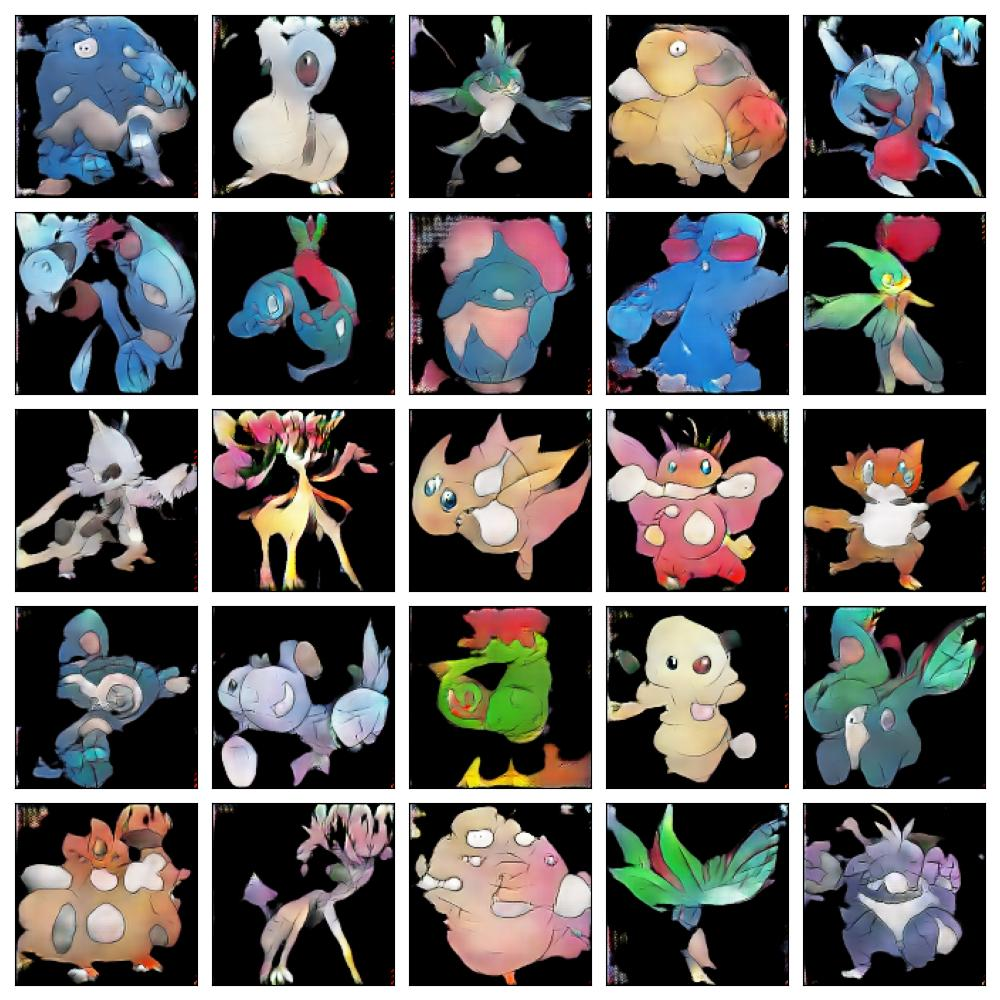

# Pokedex_project_V1.672  @ Le Wagon
  <p align="center">
  <a href="#"></a>
  <a href="#"></a>
  <a href="#"></a>
  <a href="#"></a>
  <br>
  <a href="#"></a>
  <a href="#"></a>
  <a href="#"></a>
  <br>
  <a href="#"></a>
  <a href="#"></a>
  <a href="#"></a>
  <br>
  <a href="#"></a>
  <a href="#"></a>
  </p>

This project was done at Le Wagon in two weeks, during the Data Science Bootcamp. With this project you can classify by types and names the 151 first pocket monsters (A.K.A Pokémon), thanks to a CNN model. But that's not it ! You can also generate new ones thanks to a GAN model 🔥

To test the app, go on this website : https://pokemon-generator-1672.streamlit.app/

## Installation
First let's clone the repository :
```
git clone https://github.com/Just-PH/lewagon-pokedex-gan.git
```

Then run the installation :
```
cd backend
make start
```
⚠️ Then you need to modify in the file /backend/.env the variable WHO with your name ⚠️

## Test

Still in /backend
To test both predictions functions on all images :
```
make run_test
```
If you only want to test for the types :
```
make run_test_15
```
If you only want to test for the names :
```
make run_test_150
```
## Predictions

⚠️ PUT any image you want to test in the repository all_prediction_images/images ⚠️

To predict them :
```
make run_pred
```
If you only want to predict for the types :
```
make run_pred_15
```
If you only want to predict for the names :
```
make run_pred_150
```

## Generation

To generate this kind of images :



You can use this command :

```
make run_generate
```
The image will be in the repository named output_gan

## Api
To run locally the api :
```
make run_api_local
```
